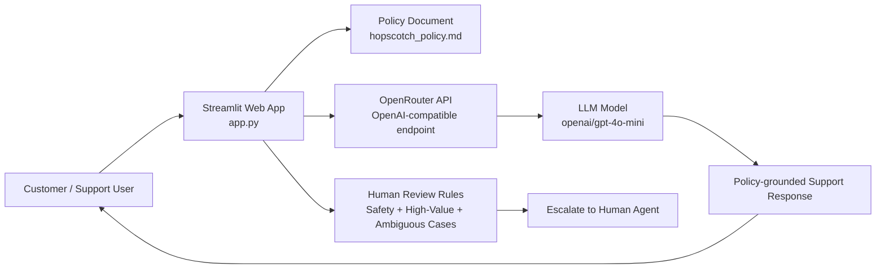

# Hopscotch Support Chat Bot

A lightweight customer-support assistant for Hopscotch that helps answer return, refund, and defect-related questions using a policy-grounded prompt and a modern conversational UI.

The application is built with Python and Streamlit, and it uses the OpenAI-compatible OpenRouter API to generate policy-aware support responses while enforcing a strict human-review workflow for high-risk cases.

## Overview

This project provides a chat experience where shoppers can ask questions such as:

- Can I return an item after 30 days?
- What qualifies as a manufacturing defect?
- What should I do if my order is above INR 5,000?
- Is my complaint eligible for automatic approval or should it go to a human agent?

The bot is designed to be policy-first: it answers using the rules in `hopscotch_policy.md` and refuses to invent exceptions or decide cases that require human intervention.

## Key Features

- Streamlit-based conversational interface
- Policy-based response generation grounded in `hopscotch_policy.md`
- OpenAI-compatible API integration through OpenRouter
- Memory of the full chat history in session state
- Human-review guardrails for safety and high-risk issues
- Clear separation between customer-facing responses and internal policy logic
- Simple, fast setup for demo, prototyping, and internal support workflows

## Architecture



## How It Works

1. The user submits a support question in the Streamlit chat interface.
2. The app loads the policy from `hopscotch_policy.md` and injects it into the system prompt.
3. The full conversation history is sent to the model along with the policy and operational guardrails.
4. The model answers only from the defined policy and avoids making decisions outside the rules.
5. For cases requiring human review, the app instructs the model to escalate instead of deciding automatically.

## Tech Stack

- Python 3
- Streamlit
- OpenAI Python SDK
- python-dotenv
- OpenRouter API

## Project Structure

```text
hopscotch-chat-bot/
├── app.py                  # Streamlit app entry point
├── hopscotch_policy.md     # Policy used to ground the bot's responses
├── requirements.text        # Python dependencies
├── .env                    # Local environment variables (not committed)
├── .gitignore              # Git ignore rules
├── .venv                   # Local virtual environment
└── README.md               # Project documentation
```

## Prerequisites

Before running the project, make sure you have:

- Python 3.10 or newer
- A virtual environment tool such as `venv`
- An OpenRouter API key from: https://openrouter.ai/keys

## Setup

### 1. Clone the repository

```bash
git clone https://github.com/shank-ai/hopscotch-support-chat-bot.git
cd hopscotch-support-chat-bot
```

### 2. Create and activate a virtual environment

```bash
python -m venv .venv
```

On Windows:

```powershell
.venv\Scripts\Activate.ps1
```

On macOS/Linux:

```bash
source .venv/bin/activate
```

### 3. Install dependencies

```bash
pip install -r requirements.text
```

### 4. Configure the environment

Create a `.env` file in the project root with your OpenRouter key:

```env
OPENROUTER_API_KEY=your_openrouter_api_key_here
```

Important: do not commit your `.env` file to version control.

### 5. Run the app

```bash
streamlit run app.py
```

Then open the local URL shown in the terminal in your browser.

## Environment Variables

| Variable | Required | Description |
|---|---:|---|
| `OPENROUTER_API_KEY` | Yes | API key used to authenticate requests to the OpenRouter provider. |

## Example Use Cases

The app can answer questions related to:

- standard returns within 30 days
- defect claims within 90 days
- damaged or misused goods
- child-safety concerns
- allergic reactions or skin complaints
- high-value order escalations
- unclear or conflicting fact patterns

Example prompts:

```text
I bought a dress 10 days ago, never worn, tags on — can I return it?
```

```text
The sole of my son's sneakers peeled off after 3 weeks of school.
```

```text
A button came off and my toddler nearly put it in his mouth.
```

```text
My order was ₹7,200, I want a refund.
```

## Policy & Safety Guardrails

This assistant is intentionally constrained by a policy file rather than free-form reasoning alone.

The application enforces the following behavior:

- Answers only from the approved return/refund policy
- Does not invent rules or create exceptions
- Requests additional information when required facts are missing
- Escalates cases involving child safety, allergies, high-value orders, or unclear facts
- Requires photo evidence for defect-verification scenarios

This makes the system safer and more suitable for support workflows where compliance and clarity matter.

## Deployment Notes

The current implementation is a local Streamlit application intended for internal demos or controlled deployment environments.

For production use, consider:

- secure secret management for API keys
- authentication and user access control
- logging and monitoring for support conversations
- auditability for escalated cases
- a persistent backend if chat history or analytics are required

## Limitations

- The app is a prototype and relies on a simple in-memory session flow.
- It stores conversation history in Streamlit session state, which is suitable for local usage but not a full production chat backend.
- The app uses one model configuration (`openai/gpt-4o-mini`) and does not yet support multi-provider abstraction.
- The support logic is intentionally narrow: it is designed for Hopscotch policy handling, not general customer support.

## License

This project does not currently declare a license in the repository. If you plan to share or distribute it externally, add an appropriate open-source license before publication.

## Contributing

Contributions are welcome. Suggested improvements include:

- adding a proper multi-page support dashboard
- persisting conversations to a database
- adding moderation and analytics
- expanding provider abstraction beyond OpenRouter
- improving deployment and CI/CD configuration

## Contact / Maintainer

For questions or updates related to this project, contact the repository owner or project maintainer in the relevant GitHub repository settings.

---

Built for customer support automation with policy-aware AI assistance.
